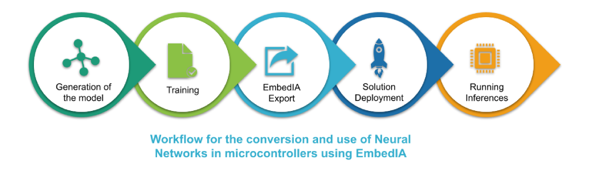

<div align="center">
  <hr>
  
  <h4><strong>EmbedIA é um framework de machine learning para desenvolver aplicações em microcontroladores.</strong></h4>
  <a href="https://github.com/Embed-ML/EmbedIA"></a>
  <a href="https://colab.research.google.com/github/Embed-ML/EmbedIA/blob/main/Using_EmbedIA.ipynb"></a>
  <hr>
</div>

**Idiomas:** [English](README.md) | [Español](README_ES.md) | [Deutsch](README_DE.md) | [Français](README_FR.md) | [Italiano](README_IT.md) | [Português](README_PT.md) | [Русский](README_RU.md) | [中文](README_ZH.md) | [日本語](README_JA.md)

EmbedIA é um framework de machine learning compacto e leve para implantar modelos em microcontroladores com recursos de hardware limitados. Ele suporta tanto modelos de redes neurais (treinados com TensorFlow/Keras) quanto algoritmos de machine learning (do Scikit-learn), permitindo a execução eficiente de inferência em sistemas embarcados. Ele é projetado para ser compatível com as linguagens C e C++ para o Arduino IDE e suporta uma ampla gama de microcontroladores (MCUs).

## 📑 Índice <A NAME="tabla-de-contenidos"></A>
* [Fluxo de trabalho](#workflow)
* [Camadas](#layers)
* [Primeiros passos](#started)
* [EmbedIA em C](#inC)


## 🔨 Fluxo de trabalho <A NAME="workflow"></A>
EmbedIA suporta dois tipos de modelos de machine learning:

### 🧠 Para Redes Neurais (TensorFlow/Keras)
1. <strong>Geração do modelo:</strong> Selecionar arquitetura, configurar hiperparâmetros e preparar dados de treinamento.
2. <strong>Treinamento:</strong> Treinar sua Rede Neural usando TensorFlow/Keras em Python.
3. <strong>Exportação EmbedIA:</strong> Converter e exportar o modelo para C/C++ usando o conversor EmbedIA.
4. <strong>Implantação:</strong> Compilar o projeto na plataforma de microcontrolador de destino.
5. <strong>Inferência:</strong> Executar previsões no dispositivo embarcado.

### 🤖 Para Modelos de Machine Learning (Scikit-learn)
1. <strong>Treinamento do modelo:</strong> Treinar classificadores ou regressores usando Scikit-learn.
2. <strong>Exportação EmbedIA:</strong> Converter o modelo treinado para C/C++ usando o conversor EmbedIA.
3. <strong>Implantação:</strong> Compilar o projeto na plataforma de microcontrolador de destino.
4. <strong>Inferência:</strong> Executar previsões no dispositivo embarcado.

<p align="center">  </p>


## 🧅 Camadas e Modelos <A NAME="layers"></A>
EmbedIA suporta um conjunto abrangente de camadas para redes neurais e modelos de frameworks de machine learning populares:

### ⚡ Camadas de Redes Neurais (TensorFlow/Keras)

**Camadas Convolucionais:**
* <a href="https://keras.io/api/layers/convolution_layers/convolution1d/">Conv1D</a>
* <a href="https://keras.io/api/layers/convolution_layers/convolution2d/">Conv2D</a>
* <a href="https://keras.io/api/layers/convolution_layers/separable_convolution2d/">SeparableConv2D</a>
* <a href="https://keras.io/api/layers/convolution_layers/depthwise_convolution2d/">DepthwiseConv2D</a>

**Camadas Principais:**
* <a href="https://keras.io/api/layers/core_layers/dense/">Dense</a>

**Camadas de Pooling:**
* <a href="https://keras.io/api/layers/pooling_layers/max_pooling1d/">MaxPooling1D</a>
* <a href="https://keras.io/api/layers/pooling_layers/max_pooling2d/">MaxPooling2D</a>
* <a href="https://keras.io/api/layers/pooling_layers/global_max_pooling1d/">GlobalMaxPooling1D</a>
* <a href="https://keras.io/api/layers/pooling_layers/global_max_pooling2d/">GlobalMaxPooling2D</a>
* <a href="https://keras.io/api/layers/pooling_layers/average_pooling1d/">AveragePooling1D</a>
* <a href="https://keras.io/api/layers/pooling_layers/average_pooling2d/">AveragePooling2D</a>
* <a href="https://keras.io/api/layers/pooling_layers/global_average_pooling1d/">GlobalAveragePooling1D</a>
* <a href="https://keras.io/api/layers/pooling_layers/global_average_pooling2d/">GlobalAveragePooling2D</a>

**Camadas de Remodelagem:**
* <a href="https://keras.io/api/layers/reshaping_layers/flatten/">Flatten</a>
* <a href="https://keras.io/api/layers/reshaping_layers/zero_padding2d/">ZeroPadding2D</a>

**Camadas de Normalização:**
* <a href="https://keras.io/api/layers/normalization_layers/batch_normalization/">BatchNormalization</a>

**Funções de Ativação:**
* <a href="https://keras.io/api/layers/activations/#relu-function">ReLU</a>
* <a href="https://keras.io/api/layers/activations/#leakyrelu-function">LeakyReLU</a>
* <a href="https://keras.io/api/layers/activations/#relu6-function">ReLU6</a>
* <a href="https://keras.io/api/layers/activations/#sigmoid-function">Sigmoid</a>
* <a href="https://keras.io/api/layers/activations/#softmax-function">Softmax</a>
* <a href="https://keras.io/api/layers/activations/#softplus-function">Softplus</a>
* <a href="https://keras.io/api/layers/activations/#softsign-function">Softsign</a>
* <a href="https://keras.io/api/layers/activations/#tanh-function">Tanh</a>

**Camadas Quantizadas (Larq):**
* <a href="https://docs.larq.dev/larq/api/layers/#quantconv2d">QuantConv2D</a>
* <a href="https://docs.larq.dev/larq/api/layers/#quantdense">QuantDense</a>
* <a href="https://docs.larq.dev/larq/api/layers/#quantseparableconv2d">QuantSeparableConv2D</a>

### 🎯 Modelos de Machine Learning (Scikit-learn)

**Pré-processamento:**
* <a href="https://scikit-learn.org/stable/modules/generated/sklearn.preprocessing.MaxAbsScaler.html">MaxAbsScaler</a>
* <a href="https://scikit-learn.org/stable/modules/generated/sklearn.preprocessing.MinMaxScaler.html">MinMaxScaler</a>
* <a href="https://scikit-learn.org/stable/modules/generated/sklearn.preprocessing.StandardScaler.html">StandardScaler</a>
* <a href="https://scikit-learn.org/stable/modules/generated/sklearn.preprocessing.RobustScaler.html">RobustScaler</a>

**Modelos de Classificação e Regressão:**
* <a href="https://scikit-learn.org/stable/modules/generated/sklearn.neighbors.KNeighborsClassifier.html">Classificador K-Nearest Neighbors</a>
* <a href="https://scikit-learn.org/stable/modules/generated/sklearn.neighbors.KNeighborsRegressor.html">Regressor K-Nearest Neighbors</a>
* <a href="https://scikit-learn.org/stable/modules/generated/sklearn.svm.SVC.html">Classificador Support Vector Machine (SVM)</a>
* <a href="https://scikit-learn.org/stable/modules/svm.html">Classificador SVM Linear</a>
* <a href="https://scikit-learn.org/stable/modules/generated/sklearn.tree.DecisionTreeClassifier.html">Classificador de Árvore de Decisão</a>

### 🔊 Camadas Nativas de Processamento de Sinal

* **STFT:** Transformada de Fourier de Tempo Curto para análise multi-espectral 1D
* **Espectrograma:** Camada de processamento de sinal para análise de áudio e sinais

## 🚀 Primeiros passos <A NAME="started"></A>
Para usar o conversor Python do EmbedIA, o primeiro passo é clonar o repositório:

```bash
git clone https://github.com/Embed-ML/EmbedIA.git
cd EmbedIA
```

Abra o script <a href="https://github.com/Embed-ML/EmbedIA/blob/main/create_embedia_project.py">create_embedia_project.py</a> e configure os parâmetros do conversor. Este script suporta tanto modelos TensorFlow/Keras quanto modelos Scikit-learn:

**Parâmetros Principais:**
* _OUTPUT_FOLDER_: caminho da pasta de saída
* _PROJECT_NAME_: nome do projeto gerado
* _MODEL_FILE_: caminho do modelo (formato .h5 para Keras, ou modelo serializado para Scikit-learn)

**Opções de Configuração:**
* _options.embedia_folder_: pasta dos arquivos EmbedIA:
  * ```options.embedia_folder = ...```
* _options.project_type_: tipo de projeto entre os disponíveis:
  * ```ProjectType.ARDUINO```
  * ```ProjectType.C```
  * ```ProjectType.CPP```
  * ```ProjectType.CODEBLOCK```
  * ```ProjectType.CMAKE_C```
  * ```ProjectType.CMAKE_CPP```
* _options.micro_: seleção do tipo de microcontrolador entre os disponíveis:
  * ```ModelMicro.GENERIC```
  * ```ModelMicro.ESP32```
* _options.data_type_: seleção do tipo de dado entre os disponíveis:
  * ```ModelDataType.FLOAT```
  * ```ModelDataType.FIXED32```
  * ```ModelDataType.FIXED16```
  * ```ModelDataType.FIXED8```
  * ```ModelDataType.QUANT8```
  * ```ModelDataType.FULL_QUANT8```
  * ```ModelDataType.BINARY```
  * ```ModelDataType.BINARY_FIXED32```
  * ```ModelDataType.BINARY_FLOAT16```
* _options.fixed_precision_: número de bits fracionários para tipos de dados de ponto fixo (None para padrão):
  * ```options.fixed_precision = 16```
* _options.tamano_bloque_: opções para tamanho de bloco de camadas binárias:
  * ```BinaryBlockSize.Bits8```
  * ```BinaryBlockSize.Bits16```
  * ```BinaryBlockSize.Bits32```
  * ```BinaryBlockSize.Bits64```
* _options.debug_mode_: opções para inclusão e uso de funções de depuração:
  * ```DebugMode.DISCARD```
  * ```DebugMode.DISABLED```
  * ```DebugMode.HEADERS```
  * ```DebugMode.DATA```
* _options.files_: Seleção de arquivos a serem executados:
  * ```ProjectFiles.ALL()```
  * ```{ProjectFiles.MAIN}```
  * ```{ProjectFiles.MODEL}```
  * ```{ProjectFiles.LIBRARY}```
* _options.model_: modelo suportado para converter (TensorFlow/Keras, Scikit-Learn, etc.)
* _options.preprocessing_: lista/objeto para pré-processamento de dados (ex: normalização)
  * ```options.preprocessing_ = []```
* _options.example_data_: array de dados para incluir como exemplos:
  * ```options.example_data = samples```
* _options.example_labels_: array de rótulos para exemplos (classificação):
  * ```options.example_labels = labels```
* _options.baud_rate_: Apenas para Arduino, definir velocidade do dispositivo Serial:
  * ```options.baud_rate = 9600```
* _options.verbose_: saída detalhada durante a geração do projeto:
  * ```options.verbose = True```
* _options.clean_output_: se True, remove a pasta de saída e inicia uma exportação limpa:
  * ```options.clean_output = True```
* _options.output_subfolder_: nome da pasta para armazenar todos os arquivos embedia:
  * ```options.output_subfolder = 'embedia'```

Execute o script da seguinte forma:
```bash
python create_embedia_project.py
```

Se o processo foi bem-sucedido, uma mensagem será exibida indicando onde o projeto foi gerado.

**Exemplos:**
* <strong>TensorFlow/Keras:</strong> Consulte o <a href="https://colab.research.google.com/github/Embed-ML/EmbedIA/blob/main/Using_EmbedIA.ipynb">notebook do Google Colab</a> para um exemplo completo de conversão de um modelo CNN treinado no dataset MNIST para linguagem C.
* <strong>Simulação:</strong> Experimente o código gerado online no <a href="https://wokwi.com/projects/359745013247499265">simulador Wokwi</a>.


## 👍 EmbedIA em C/C++ <A NAME="inC"></A>
Para usar os recursos do EmbedIA no microcontrolador, você precisa incluir a inicialização do modelo e a execução de inferência no seu código, usando as funções fornecidas:

* ```void model_init(void)```: Inicializa o modelo em linguagem C, carregando os pesos e parâmetros convertidos do seu modelo treinado (TensorFlow/Keras ou Scikit-learn).
* ```int model_predict(input, * results)```: Executa a inferência usando os dados de entrada passados como parâmetro. Esta função constrói a arquitetura completa do modelo concatenando as saídas das camadas na ordem correta. Ela retorna o resultado da previsão e preenche o array de resultados com pontuações de confiança ou valores de saída.

<strong>Exemplo (Classificação):</strong>
```c
// inicialização do modelo
model_init();

// inferência do modelo
int prediction = model_predict(input, &results);

// 'prediction' contém o ID da classe prevista
// 'results' contém as pontuações de confiança para cada classe
```

<strong>Exemplo (Regressão ou Multi-saída):</strong>
```c
// inicialização do modelo
model_init();

// inferência do modelo - para modelos de regressão ou multi-saída
int status = model_predict(input, &results);

// 'results' contém os valores previstos
```
